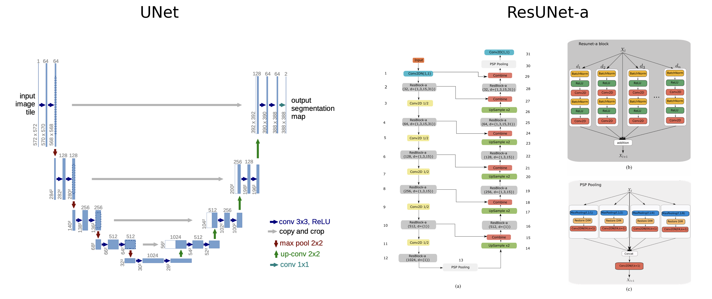
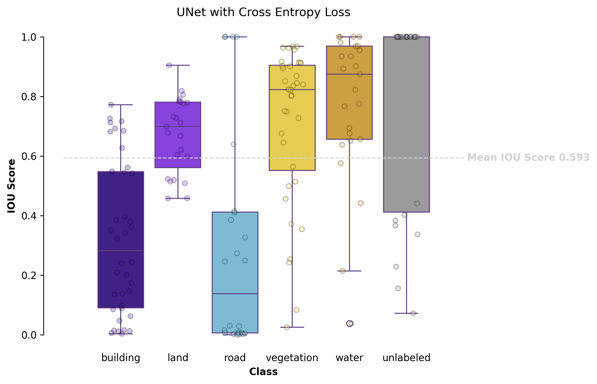
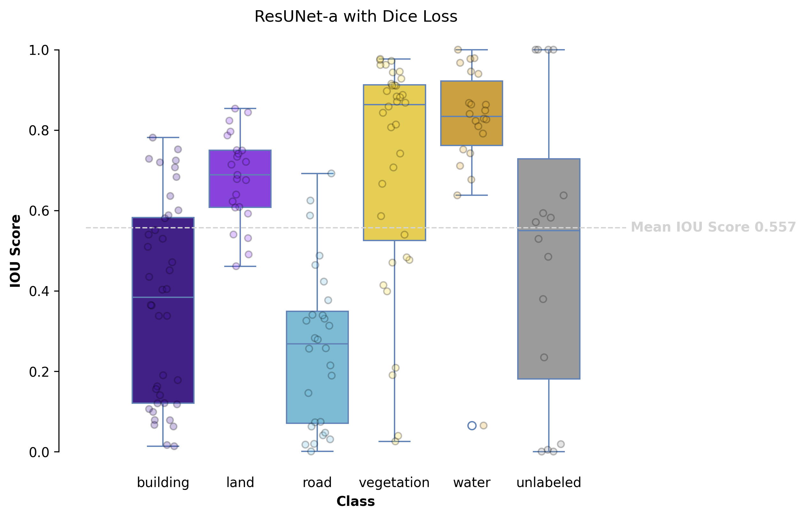

# Land Cover Segmentation with UNets (in progress)
Semantic segmentation of the [Multi-Source Satellite Imagery for Segmentation Dataset](https://www.kaggle.com/datasets/hammadjavaid/multi-source-satellite-imagery-for-segmentation/data) with [UNet](https://link.springer.com/chapter/10.1007/978-3-319-24574-4_28) and [ResUNet-a](https://arxiv.org/abs/1904.00592) in PyTorch, with graphical interface in Streamlit.


Install all dependencies
```bash
pip install -r requirements.txt
```

Run the app locally using this command to see the segmentation results.
```bash
python -m streamlit run app.py
```

## Results 


## Architectures



## Augmentation [Optional]
Use the `augment` method in the dataset class to create randomly cropped, flipped and color changed images. <br>
Change the dataset initialization to the following code in the notebook and run all the cells to re-train the models.

```python
dataset = SatelliteImageDataset(
    image_dir='data/images',mask_dir='data/masks',
)
dataset.augment(dest_image_dir='data/augmented_images', dest_mask_dir='data/augmented_masks')
```

The `augment` method only has to be executed once. Use this command if you would want to load the dataset in different files.

```python
dataset = SatelliteImageDataset(
    image_dir='data/images',
    mask_dir='data/masks',
    aug_image_dir='data/augmented_images',
    aug_mask_dir='data/augmented_masks'
)
```

## Preprocessing
1. __Sharpen__ `transforms.functional.adjust_sharpness(image, 2)`
2. __Increased saturation__ `transforms.ColorJitter(contrast=(1.25, 1.25))`
<p align='center'>
  
</p>

## Model Comparison
### Accuracy

<p align='center'>
  
</p>

### Intersection Over Union (IOU)


## References
[Multi-Source Satellite Imagery for Segmentation](https://www.kaggle.com/datasets/hammadjavaid/multi-source-satellite-imagery-for-segmentation/data) on Kaggle <br>
[ResUNet-a: a deep learning framework for semantic segmentation of remotely sensed data](https://arxiv.org/abs/1904.00592) by Foivos I. Diakogiannis, François Waldner, Peter Caccetta & Chen Wu <br>
[U-Net: Convolutional Networks for Biomedical Image Segmentation](https://link.springer.com/chapter/10.1007/978-3-319-24574-4_28) by Olaf Ronneberger, Philipp Fischer & Thomas Brox <br>

